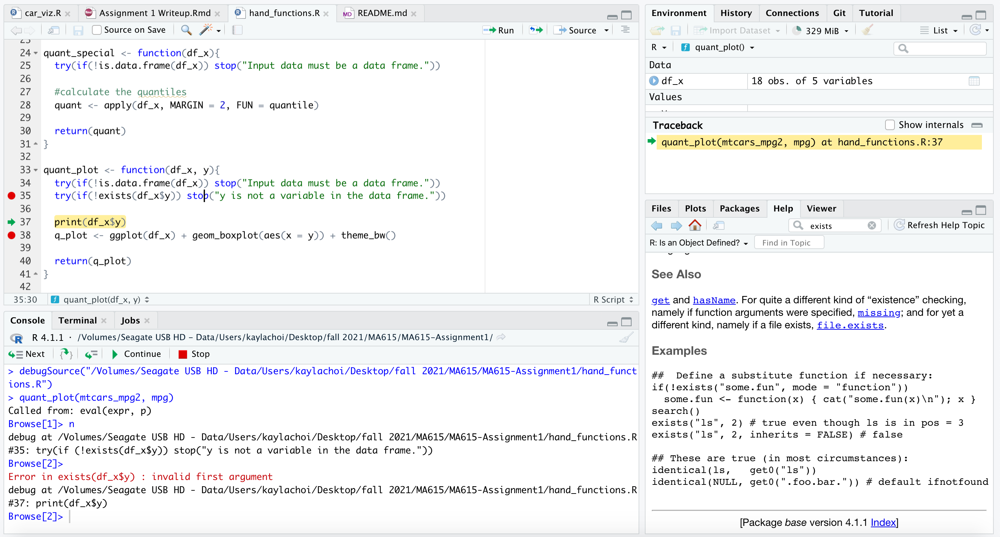
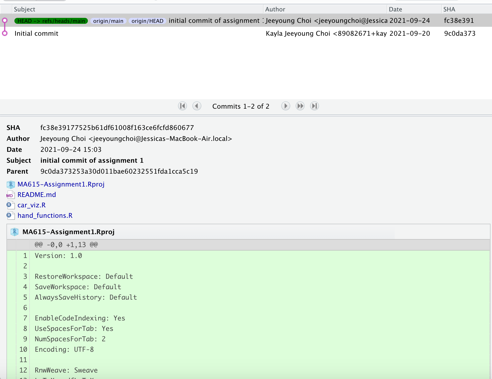

```{r setup, include=FALSE}
knitr::opts_chunk$set(echo = TRUE)
```

  
I moved all test code from "hand_functions.R" to "car_viz.R," making sure to source the "hand_functions.R" file to retrieve the desired function.   
  
  

Here is my attempt at using the debugger for a function I did not end up keeping. 
  

  
  
Here is my git log. 
  

